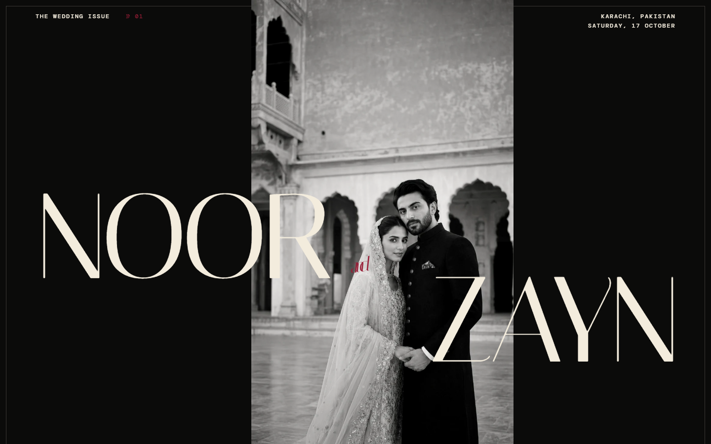

# Noor & Zayn — Contemporary Pakistani Editorial

A standalone wedding invitation concept built around an ivory, black, and oxblood editorial system. The project is separate from the original `Invitation` website and can be placed in its own GitHub repository.



## Run locally

```sh
npm install
npm run dev
```

## Production build

```sh
npm run build
```

The production command uses relative asset paths, so it can be deployed to any GitHub Pages repository without changing the repository name in the code.

## Editing event details

The sample names, timings, venue, map link, and RSVP deadline are in `index.html`. The countdown date and calendar download are configured near the top of `src/main.js`.

## RSVP delivery

The demo validates and stores the response in the guest's browser. To receive submissions, add a form service endpoint to the `data-endpoint` attribute on `#rsvp-form`; the existing script will send JSON to it automatically.
